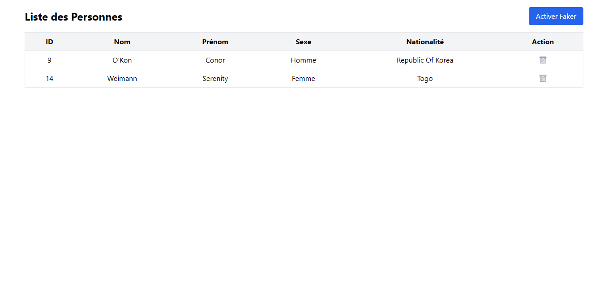

# Application React + Express avec Faker.js

Ce projet démontre l'intégration d'un frontend React/Vite avec un backend Express, utilisant Faker.js pour générer des données fictives dans une base PostgreSQL.

## Fonctionnalité Faker - Ajout de données fictives

### Installation

```bash
npm install @faker-js/faker --save
```

## demonstration en image :

### 1.

  
\*Données initial

---

### 2.

  
\*Données apres avoir activer facker

---

### 3.

  
\*Prochain données apres avoir activer facker

---

### 4.

  
\*Et ainsi de suite
